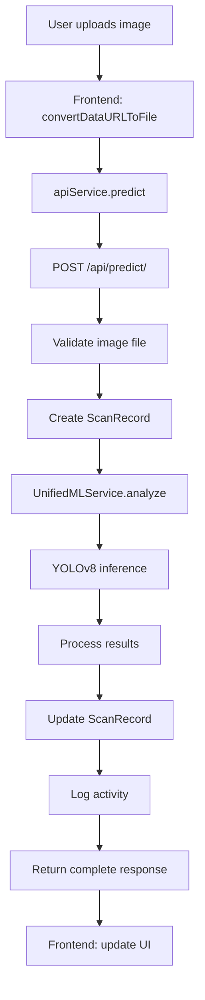
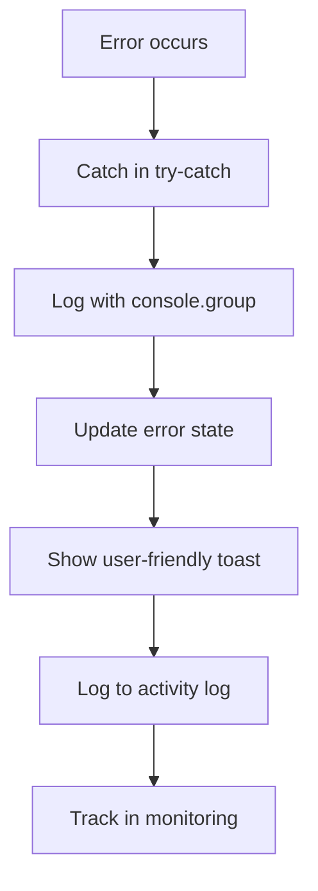

# SagiTech Architecture Guide

## System Overview

SagiTech is a web-based AI system for Saba banana ripeness detection and yield prediction, designed specifically for Filipino farmers.

## Architecture Principles

### 1. Single Endpoint Architecture
**CRITICAL RULE**: ONE FUNCTION = ONE ENDPOINT ONLY

✅ **Correct**:
- `/api/predict/` - Complete prediction pipeline (upload → process → return results)
- `/api/prediction/{id}/` - Retrieve specific prediction
- `/api/predictions/` - List predictions with pagination
- `/api/analytics/` - User analytics

❌ **Wrong**:
- Multiple endpoints for one operation (upload → process → results)
- Separate endpoints for counting and classification
- Duplicate functionality across endpoints

### 2. Error-First Design
- Comprehensive error handling at every layer
- Structured logging with console groups
- User-friendly error messages
- Technical details in development mode only

### 3. Performance-First Implementation
- React.memo for expensive components
- Custom hooks for code reuse
- Lazy loading and virtualization
- Image optimization
- Database indexing

## Technology Stack

### Frontend
- **Framework**: React 18 with TypeScript
- **Routing**: React Router v6
- **Styling**: Tailwind CSS with custom glass morphism
- **State Management**: React hooks + custom hooks
- **HTTP Client**: Fetch API with comprehensive error handling
- **Build Tool**: Vite

### Backend  
- **Framework**: Django 5.2 with Django REST Framework
- **Database**: SQLite (development) / PostgreSQL (production)
- **Authentication**: JWT with SimpleJWT
- **File Storage**: Django file system (development) / S3 (production)
- **Caching**: Django cache framework
- **Task Queue**: Celery (if needed)

### ML/AI
- **Model**: YOLOv8 for banana detection and segmentation
- **Training Platform**: Roboflow for annotation
- **Classes**: "Not Mature", "Mature", "Ripe", "Over Ripe"
- **Detection Method**: Bounding boxes with polygon segmentation
- **Inference**: Unified ML Service with lazy loading

## Directory Structure

```
Capstone-SagiTech/
├── frontend/
│   ├── src/
│   │   ├── components/
│   │   │   ├── ui/                 # Reusable UI components
│   │   │   ├── optimized/          # Performance-optimized components
│   │   │   ├── ErrorBoundary.tsx   # Global error handling
│   │   │   └── LoadingSkeleton.tsx # Loading states
│   │   ├── hooks/
│   │   │   ├── useAuth.ts          # Authentication logic
│   │   │   ├── useApiError.ts      # Error handling
│   │   │   ├── useImageUpload.ts   # Image upload logic
│   │   │   └── usePrediction.ts    # ML prediction logic
│   │   ├── services/
│   │   │   └── ApiService.ts       # Centralized API calls
│   │   ├── config/
│   │   │   └── constants.ts        # Application constants
│   │   ├── types/
│   │   │   └── index.ts           # TypeScript definitions
│   │   └── pages/
│   │       ├── dashboard/farmer/   # Farmer-specific pages
│   │       └── dashboard/admin/    # Admin-specific pages
└── backend/
    ├── api/
    │   ├── models.py              # Enhanced data models
    │   ├── views.py               # Standard CRUD views
    │   ├── ml_views.py            # ML-specific views (single endpoint)
    │   ├── serializers.py         # API serializers
    │   ├── middleware.py          # Security & monitoring middleware
    │   ├── utils/
    │   │   ├── security.py        # Security utilities
    │   │   └── monitoring.py      # Performance monitoring
    │   └── tests/                 # Comprehensive test suite
    └── ml/
        ├── services/
        │   └── unified_ml_service.py  # Single ML service
        ├── banana_detection/
        ├── yield_prediction/
        └── core/
```

## Data Flow

### Prediction Pipeline (Single Endpoint)



### Error Handling Flow



## Database Schema

### ScanRecord (Enhanced)
```sql
CREATE TABLE api_scanrecord (
    id SERIAL PRIMARY KEY,
    user_id INTEGER REFERENCES auth_user(id),
    image VARCHAR(100),
    timestamp TIMESTAMP DEFAULT NOW(),
    
    -- Core results
    banana_count INTEGER DEFAULT 0,
    ripeness_results JSONB DEFAULT '[]',
    avg_confidence FLOAT DEFAULT 0.0,
    
    -- Enhanced metadata  
    analysis_mode VARCHAR(20) DEFAULT 'standard',
    processing_time FLOAT DEFAULT 0.0,
    model_version VARCHAR(50) DEFAULT 'unknown',
    confidence_threshold FLOAT DEFAULT 0.5,
    quality_score FLOAT NULL,
    has_segmentation BOOLEAN DEFAULT FALSE,
    
    -- Error tracking
    error_message TEXT NULL,
    retry_count INTEGER DEFAULT 0,
    image_metadata JSONB DEFAULT '{}',
    
    -- Indexes for performance
    INDEX idx_user_timestamp (user_id, timestamp DESC),
    INDEX idx_timestamp (timestamp),
    INDEX idx_banana_count (banana_count)
);
```

## API Response Standards

### Success Response Format
```json
{
  "id": number,
  "data": {...},
  "metadata": {
    "timestamp": "ISO string",
    "processing_time": number,
    "version": "string"
  }
}
```

### Error Response Format
```json
{
  "error": "Brief error description",
  "details": "User-friendly message", 
  "technical_details": "Technical details (dev only)",
  "timestamp": "ISO string",
  "request_id": "string"
}
```

## Security Architecture

### Authentication Flow
1. User logs in with email/password
2. Server returns JWT access + refresh tokens
3. Frontend stores tokens in localStorage
4. API requests include Bearer token
5. Auto-refresh on 401 responses
6. Logout clears all tokens

### File Upload Security
1. MIME type validation
2. File size limits (10MB)
3. Content verification (magic numbers)
4. Image validation with PIL
5. Filename sanitization
6. Secure file storage

### API Security
- Rate limiting per IP
- CORS configuration
- Security headers
- Input sanitization
- SQL injection prevention
- XSS protection

## Performance Optimizations

### Frontend
- React.memo for expensive components
- useMemo/useCallback for calculations
- Lazy loading for images
- Virtualization for large lists
- Code splitting
- Bundle optimization

### Backend
- Database indexing
- Query optimization
- Response caching
- Image optimization
- Connection pooling
- Middleware optimization

### ML Pipeline
- Image resizing for optimal processing
- Model lazy loading
- Result caching
- Batch processing (future)

## Monitoring & Observability

### Metrics Tracked
- Request response times
- Error rates
- ML model performance
- User activity
- System resource usage

### Logging Levels
- **INFO**: Normal operations
- **WARNING**: Potential issues
- **ERROR**: Failures requiring attention
- **CRITICAL**: System-wide failures

### Health Checks
- Database connectivity
- ML model availability
- File system access
- External API status

## Development Guidelines

### Code Standards
- TypeScript strict mode
- ESLint + Prettier
- Comprehensive error handling
- Performance-first implementation
- Security-conscious coding

### Testing Requirements
- Unit tests for all utilities
- Integration tests for API endpoints
- Component tests for React
- E2E tests for critical flows
- Performance testing

### Deployment Checklist
- [ ] Environment variables configured
- [ ] Database migrations applied
- [ ] Static files collected
- [ ] SSL certificates installed
- [ ] Monitoring configured
- [ ] Backup strategy implemented
- [ ] Security headers enabled
- [ ] Rate limiting configured

## Troubleshooting

### Common Issues

1. **ML Model Loading Failed**
   - Check model file exists
   - Verify dependencies installed
   - Check memory availability
   - Review error logs

2. **High Error Rate**
   - Check system health metrics
   - Review recent error logs
   - Monitor resource usage
   - Verify external API status

3. **Slow Performance**
   - Check database query times
   - Review image optimization
   - Monitor memory usage
   - Check network latency

### Debug Commands
```bash
# Generate performance report
python manage.py generate_performance_report --days 7

# Check system health
python manage.py check_system_health

# View error logs
tail -f logs/errors.log

# Monitor API requests
tail -f logs/api.log
```

## Future Enhancements

1. **Batch Analysis**: Process multiple images simultaneously
2. **Real-time Analysis**: WebSocket-based live processing
3. **Advanced Analytics**: Yield prediction and trend analysis
4. **Mobile App**: React Native implementation
5. **Offline Mode**: PWA with offline capabilities
6. **Multi-language**: Internationalization support